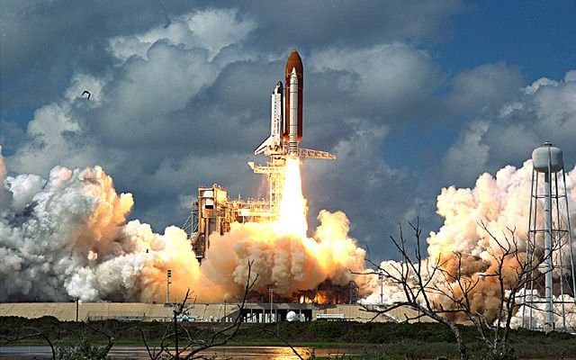

# Análisis de Temperaturas del Transbordador Espacial Challenger



La tragedia del transbordador espacial Challenger en 1986 llevó a investigaciones sobre las causas de la falla de la misión, centrándose especialmente en el comportamiento de los sellos anulares del motor del cohete. A continuación se presentan los datos de temperatura (°F) registrados durante los encendidos de prueba y lanzamientos del motor:

```python
# Datos de temperatura (°F)
datos = [84, 49, 61, 40, 83, 67, 45, 66, 70, 69, 80, 58,
         68, 60, 67, 72, 73, 70, 57, 63, 70, 78, 52, 67,
         53, 67, 75, 61, 70, 81, 76, 79, 75, 76, 58, 31]
```

Para comprender mejor cómo estas temperaturas podrían haber influido en los lanzamientos, se requiere un análisis básico de los datos.

## Preguntas Prácticas

1. **Cálculo de Medidas de Tendencia Central**:
   - Calcula la media, mediana y moda de las temperaturas.
   - ¿Qué te indican estas medidas sobre la temperatura típica de los sellos anulares?

2. **Rango y Desviación Estándar**:
   - Determina el rango de las temperaturas y calcula la desviación estándar.
   - ¿Qué nos dicen estos valores sobre la dispersión de las temperaturas en los datos?

3. **Construcción de un Histograma**:
   - Crea un histograma que muestre la distribución de las temperaturas.
   - ¿Cómo se distribuyen las temperaturas?
   - ¿Hay alguna concentración notable en ciertos rangos?

4. **Identificación de Valores Atípicos**:
   - Identifica la temperatura más baja y la más alta.
   - ¿Cuál es la diferencia entre la temperatura más baja y la siguiente más baja?
   - ¿Consideras que la temperatura más baja (31°F) podría ser un valor atípico?

5. **Análisis de Temperaturas Críticas**:
   - Según la investigación posterior al accidente, se sugirió que las temperaturas por debajo de un cierto umbral (por ejemplo, 53°F) podían ser problemáticas para el funcionamiento.
   - Calcula el porcentaje de lanzamientos que ocurrieron por debajo de este umbral.
   - ¿Cómo puede esta información ayudar a entender la probabilidad de un lanzamiento exitoso?
