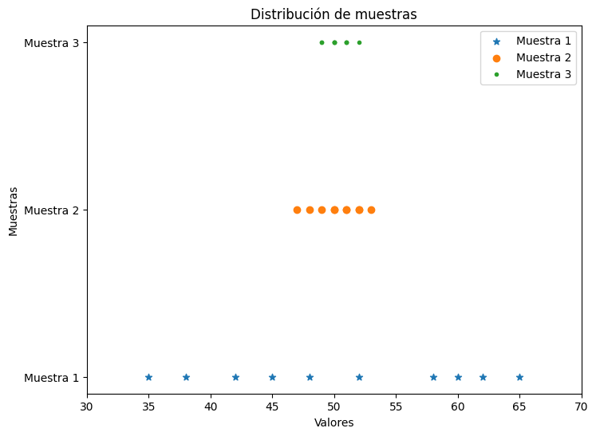

# Análisis de Medidas de Centro y Dispersión

El reporte de una medida de centro da sólo información parcial sobre un conjunto o distribución de datos. Diferentes muestras o poblaciones pueden tener medidas idénticas de centro y aún diferir entre sí en otras importantes maneras. Este ejercicio muestra gráficas de puntos de tres muestras (experimentos), aunque el grado de dispersión en torno al centro es diferente para las tres muestras:



```python
# Muestra 1: Tiene la cantidad más grande de variabilidad.
m1 = [35, 42, 58, 65, 48, 52, 60, 38, 62, 45]

# Muestra 2: Es intermedia con respecto a las otras dos en términos de variabilidad.
m2 = [48, 52, 49, 51, 50, 53, 47, 51, 52, 50]

# Muestra 3: Presenta la cantidad más pequeña de variabilidad.
m3 = [49, 51, 50, 52, 50, 49, 51, 50, 51, 50]

```

Para cada una de las tres muestras (m1, m2, m3), calcular las siguientes medidas estadísticas:

1. **Medidas de tendencia central:**
   - Media
   - Mediana
   - Moda
2. **Medidas de dispersión:**
   - Varianza
   - Desviación estándar
   - Rango
